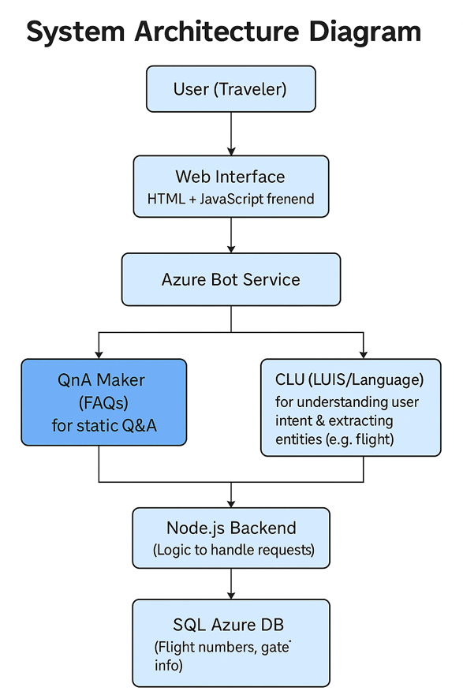

# ✈️ AirportChatbot — Data Science Senior Project

An AI-powered chatbot that assists airport passengers by answering FAQs, retrieving real-time flight information, and providing general travel guidance. Built with **Microsoft Azure CLU (Conversational Language Understanding)** and **Azure QnA Maker**, backed by a Node.js server and a SQL flight database.

---

## 🚀 Features

- 🤖 Natural language understanding via Azure CLU (intent + entity detection)
- 🛫 Real-time flight lookup from a SQL database by flight number
- 💬 FAQ answering via Azure QnA Maker knowledge base
- 🖥️ Clean, responsive web chat interface
- ☁️ Fully deployable on Microsoft Azure

---

## 🗂️ Project Structure

```
AirportChatbot/
├── Dataset/
│   └── flights.csv                  # Raw flight schedule data
├── Deploy/
│   ├── index.js                     # Node.js Express backend server
│   ├── db.js                        # Azure SQL database connection
│   ├── index.html                   # Bot channel web page
│   ├── package.json                 # Node dependencies
│   └── env                          # Environment variables template
├── Frontend/
│   ├── index.html                   # Landing page
│   ├── chatbot.html                 # Main chat UI
│   ├── about.html                   # About page
│   └── style.css                    # Styling
├── AirportFAQ-CLU.json              # Trained CLU model export
├── AirportFAQ-KB_qnas.xlsx          # Knowledge base Q&A pairs
├── ImportToCSV.ipynb                # Data processing notebook
├── SETUP.json                       # CLU project configuration
├── _cleaned_flights.csv             # Processed flight data
└── SystemArchitectureDiagram.png    # System architecture overview
```

---

## 🧠 Tech Stack

| Layer | Technology |
|---|---|
| NLU / Intent Detection | Microsoft Azure CLU |
| FAQ Answering | Azure QnA Maker |
| Backend | Node.js + Express |
| Database | Azure SQL |
| Frontend | HTML, CSS, JavaScript |
| Data Processing | Python, Jupyter Notebook, Pandas |
| Deployment | Microsoft Azure App Service |

---

## ⚙️ Setup & Installation

### Prerequisites
- Microsoft Azure account
- Node.js v16+
- Python 3.8+

### 1. Clone the repo
```bash
git clone https://github.com/YOUR_USERNAME/AirportChatbot.git
cd AirportChatbot
```

### 2. Process flight data
Open and run `ImportToCSV.ipynb` to generate `_cleaned_flights.csv`, then load it into your Azure SQL database.

### 3. Configure Azure services
- Import `AirportFAQ-CLU.json` into **Azure Language Studio** → train and deploy
- Import `AirportFAQ-KB_qnas.xlsx` into **Azure QnA Maker** → publish
- Copy your endpoints and API keys into `Deploy/env`

### 4. Install backend dependencies
```bash
cd Deploy
npm install
```

### 5. Start the server
```bash
node index.js
```

### 6. Open the Frontend
Open `Frontend/index.html` in your browser or serve it:
```bash
npx serve Frontend
```

---

## 🏗️ System Architecture



User messages are sent to the Node.js backend → Azure CLU detects intent and extracts entities (e.g. flight number) → flight queries hit the Azure SQL database, all other questions go to QnA Maker → response returned to the web frontend.

---

## 👥 Team

Developed as a Data Science Senior Project.

> **My contributions:** *(Add what you specifically worked on — e.g. backend API, CLU model training, data processing pipeline, frontend UI, database integration, etc.)*

---

## 📄 License

This project is for academic purposes. Please credit the original team if reused.
